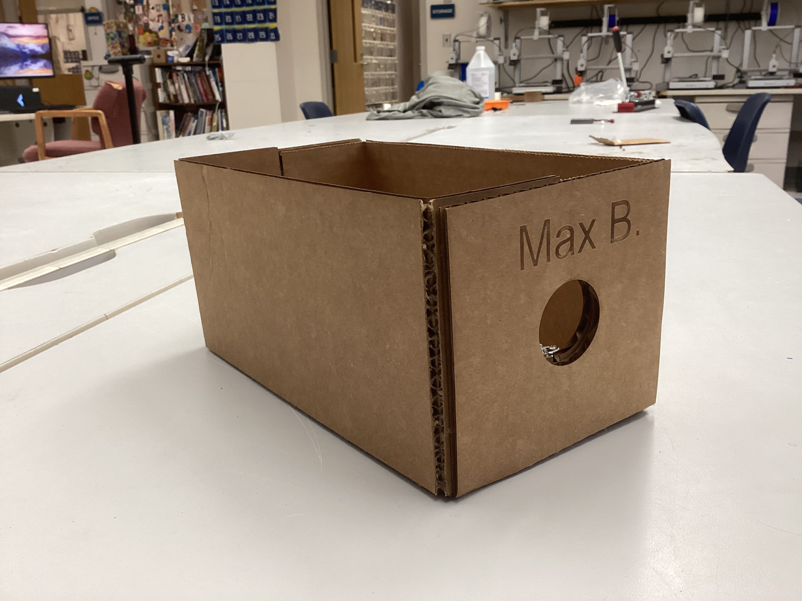
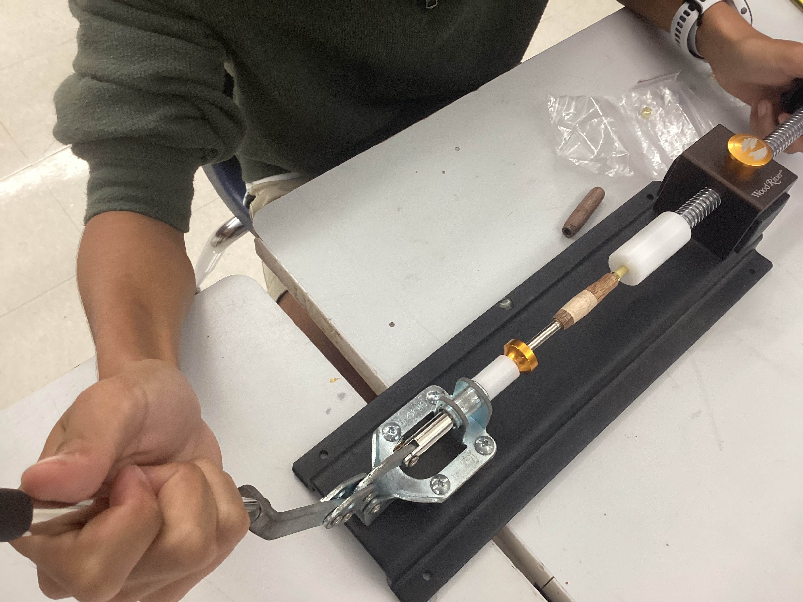
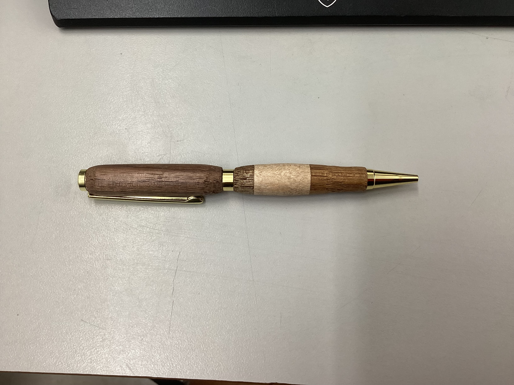
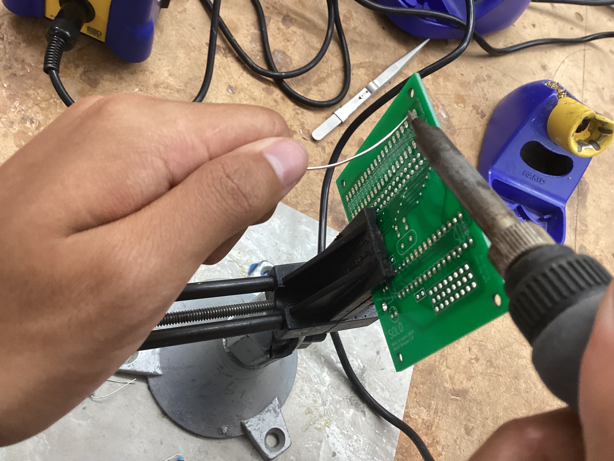
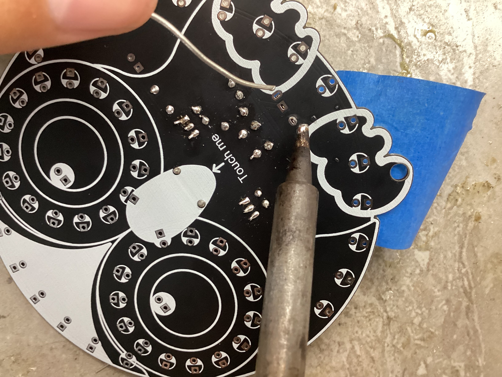
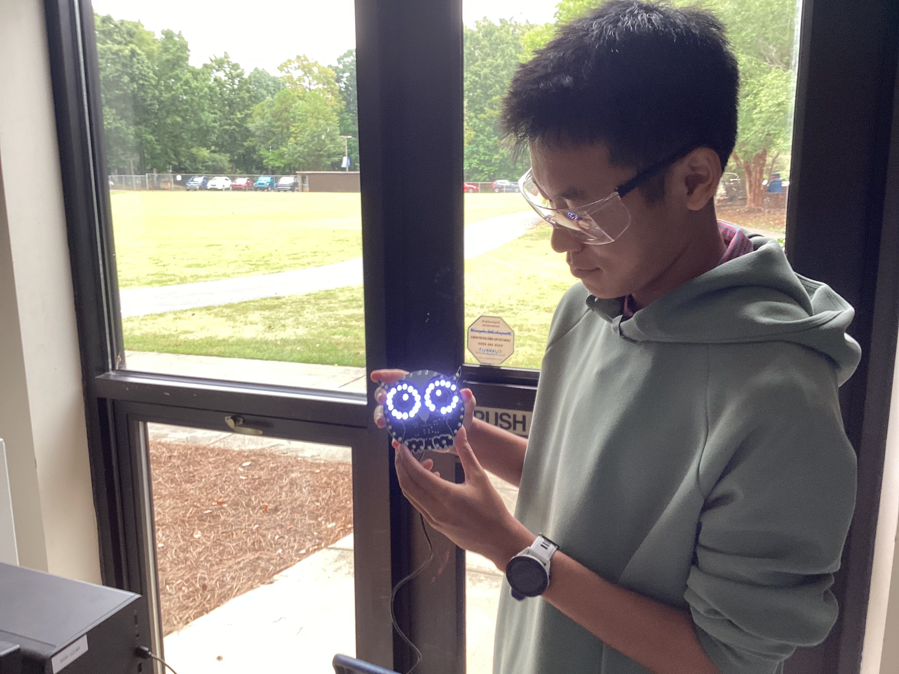
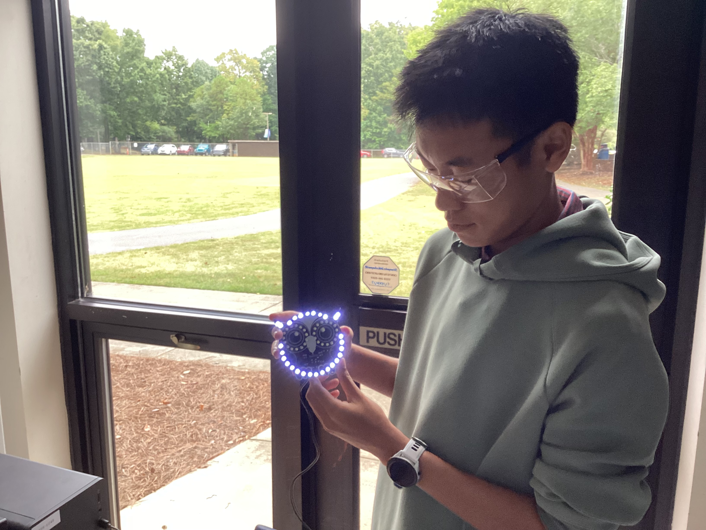
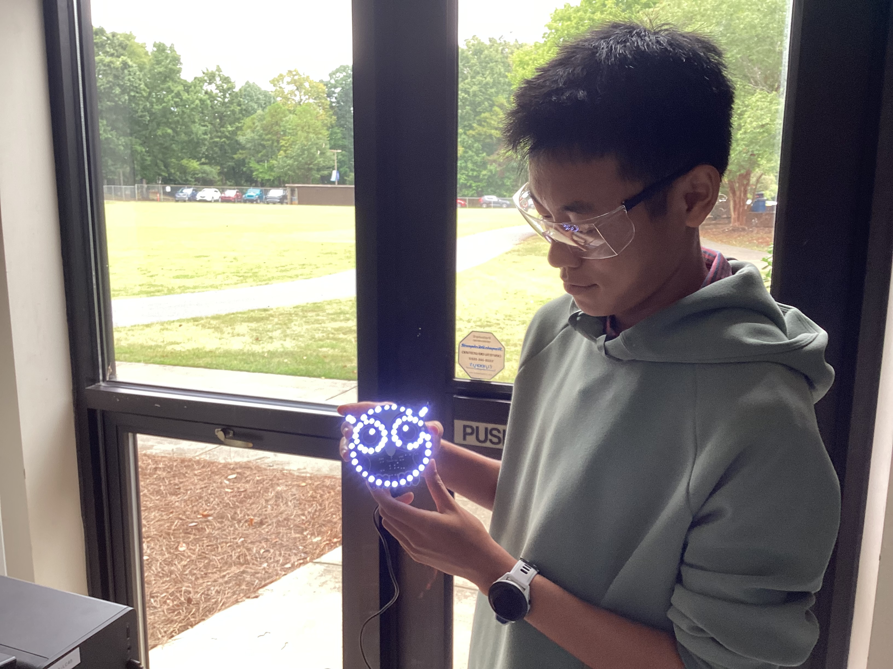

# Daily Journal

## Pen Turning Project and Laser Cutting Box

**Timeline:**

8/28:
Laser cut and assembled a personal box to hold my materials.

**Image of Assembled  Box:**

9/1:
Started the wood pen project by selecting the wood and cutting it using the wood-cutting machine.

9/3:
Finished cutting the wood and glued the pieces together.

9/4:
Drilled a hole through the wooden pieces and glued the metal shaft inside.

9/5:
Began turning the pen, but one of the wooden pieces broke during the process. I planned to remake that piece the next day.

9/8:
Cut a new piece of wood and glued the pieces together again.

9/9:
Inserted the metal shaft into the hole and attempted to log in to GitHub.

9/10:
Turned the new wooden piece and sanded both sections of the pen.

9/12:
Completed the pen by assembling all the pieces together.

**Pen Pressing:**

**Final Product of Pen:**

## Github

**Timeline:**

9/15:
Started the GitHub video tutorial. Logged into GitHub Desktop, created a new repository, and learned how to create files, commit changes, and push updates locally and to the cloud.

9/16:
Reviewed the GitHub tutorial and learned how to perform a pull request. Also learned how to share repositories with collaborators.

**Screenshot of Shared Repo with Mr.Dubick:**

## Owl Soldering Project

**Timeline:**

9/28:
Start on owl project. First practiced soldering on a practice board with 3 resistors. Then began soldering resisters, capacitors, and transistors.

**Practice Soldering:**

9/29:
Began soldering on all the LED's and the Type-C interface.

**Soldering Type-C interface on owl:**

9/30:
Finish soldering LED's and surface mount the integrated circuits. At first, the surface mount didn't work since the solder was touching, but I as able to fix it by using a solder sucker  and resoldering. 
Finished the owl!

**Image of Finished Owl:**

## Capstone Project - Yearbook Digitization

So far in my capstone project, I have made steady progress toward digitizing past Charlotte Latin yearbooks. I began by setting up my yearbook folder on GitHub and configuring the environment for my Landing.ai key to prepare for AI-assisted data extraction. I then understood the workflows for the different new codes, I worked with Mr. Dubick to review the 1975 and 1976 yearbooks, recording page numbers for sports and activities to organize the content structure. I edited YAML files to store this information. Finally, I tested the Landing.ai code for automatically extracting data from grades 6–11 using the YAML file, code file, and the new team Landing.AI key I got. 

**Timeline:**

10/1:
Revised and updated daily journals. Researched agents and orchestration techniques in Python.

10/6:
Worked with Mr. Dubick to understand the yearbook workflow. Reviewed the 1975 yearbook to record page numbers for sports and activities, organizing them into a list.

10/7:
Collected and recorded page numbers for the 1976 yearbook YAML file.

10/9:
Tested the team Landing.ai code for grade extraction across grades 6–11.

10/10:
Practiced 3D printing by printing a joy fidget toy. Also practiced laser cutting using both auto-focus and manual focus settings.

10/17:
Mr.Dubick taught us about setting up Github pages.

12/9:
Today I started trying to mill my topography graph. I uploaded the file into makeraCam, but it appeared upside down at first, but after going back to the aspire file everythign seemed fine. In the end, the upside down showing up on makeraCam was just an illusion. Additionally, when starting to cut it was in the wrong spot because the machine was set to anchor 2 instead of anchor 1.

12/10:
Today, I went through the 1975 final yearbook pdf to comapre the page numbers and name counts with the 1975 YAML file. When doing this, I first noticed that the names, name counts, and page numbers 
were incorrect majority of the time(AI attempted the first try). While it sometimes got the page numbers right(more for sports groups) and names correct, a lot of the names were made up and not within the yearbook (this happened
for the class pictures and names a lot). 

12/11:
I continued working on the 1975 YAML and finished fixing it this class. Instead of tracking names, the main focus was getting the page number and count of names right.

12/12:
Today, I started checking the 1977 YAML file. In this one, the librarians also had a name count with page numbers. After checking, majority of the name counts were correct, the only thing was that for each page, the 
librarian counted duplicate names on the same page.

12/15:
Today, I modified the 1979 yearbook to have the page numbers of the pdf align with the actual page numbers of the yearbook. Additioanlly, I checked the librarians count in the 1979 YAML file.

